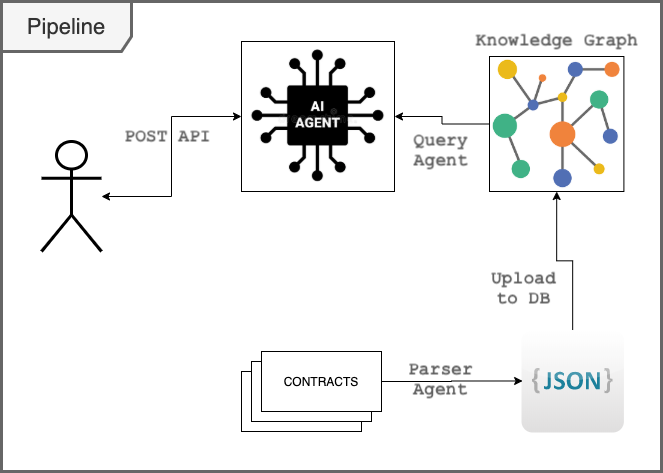

# ai-tinkerer-hackathon-25

This is a helpful assistant tasked with finding and explaining relevant information about internal legal contracts. We got the legal contract corpus from [Kaggle](https://www.kaggle.com/datasets/konradb/atticus-open-contract-dataset-aok-beta) and [CUAD](https://www.atticusprojectai.org/cuad).

We've implemented a pipeline, which has the following steps....

## AI Contract Parsing Agent

### Model

1. **Contract** - Represents the key details of the contract.
    1. **Clauses** - Represents a clause in a contract
    2. **Location** - Represents a physical location including address, city, state, and country.
    3. **Organization** - Represents an organization, including its name and location.
    4. Summary
    5. Contract Type
    6. Parties
    7. Effective Date
    8. Contract Scope
    9. Duration
    10. End Date
    11. Total Amount
    12. Governing Law

### Stages

1. This parses the plain text contract documents, according to the above model
2. Once that is complete, it also uses an AI model to add embeddings to the summary

## Uploading that to Neo4J DB

1. Once we have the parsed contracts, and the vectorized/embedded data, we save it to a Knowledge Graph DB, according to the above model/schema
2. We're using Neo4J for this, but it can work with any KG DB

**NOTE**: this part isn't implemented, as we coouldn't get it to work in time.. So, we only implemented the first part (parser agent) and the 3rd part (query agent), but the query agent directly queries from the parsed JSON files...

## AI Query Agent

1. We then implement another AI agent to query/search this DB, as a source for it's RAG-based execution

## Use Cases

1. Any law firm can use this to digitally document their previous cases and contracts, and query or search for it.
2. This can even be licensed as a tool for lawyers or law practitioners
3. People can even subscribe to this product...

## Architecture diagram

